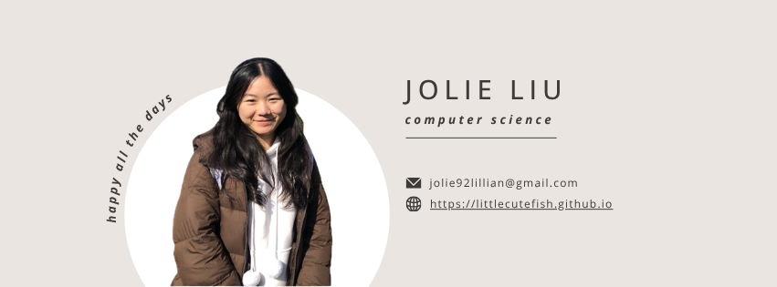

    

<h1 align="center">Hey Everyone 👋, I'm Jolie Liu</h1>

 
     

- 🏫 I'm a master degree student in NTUST
- 🌱 I'm currently learning Cybersecurity, Diffusion Model, GenAI
- 📫 How to reach me: jolie92lillian@gmail.com
- 📍 From Taiwan
- 🌐 My website: https://littlecutefish.github.io/

## <b> Connect with me</b>

## <b> Skills</b>

Programming Languages
  

 

    

Frontend Development
  

Databases
  

Software
  

AI Tools
  

Model Training
  

    

 

Application and Tools
     

    
    

  <picture>
    <source media="(prefers-color-scheme: dark)" srcset="https://github.com/littlecutefish/littlecutefish/blob/output/github-snake-dark.svg" />
    <source media="(prefers-color-scheme: light)" srcset="https://github.com/littlecutefish/littlecutefish/blob/output/github-snake.svg" />
    
  </picture>

